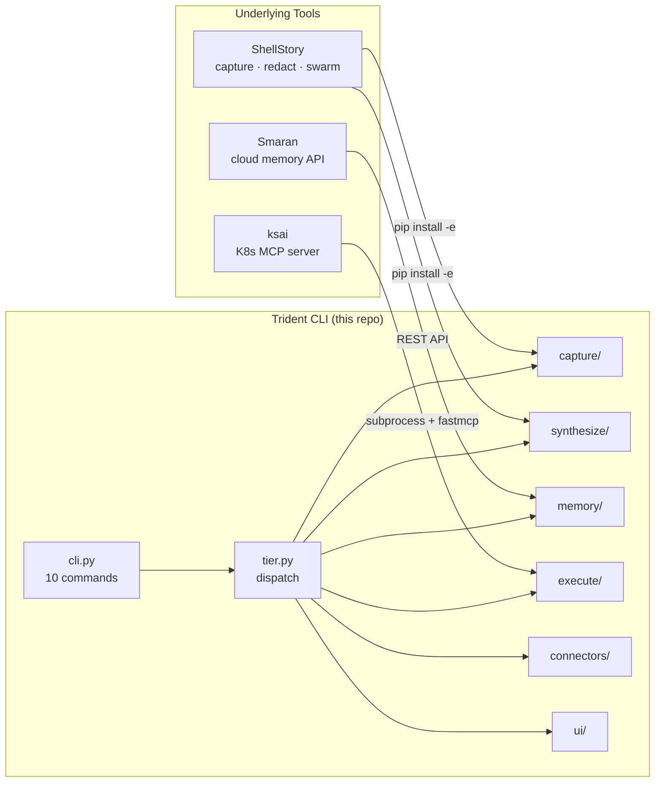
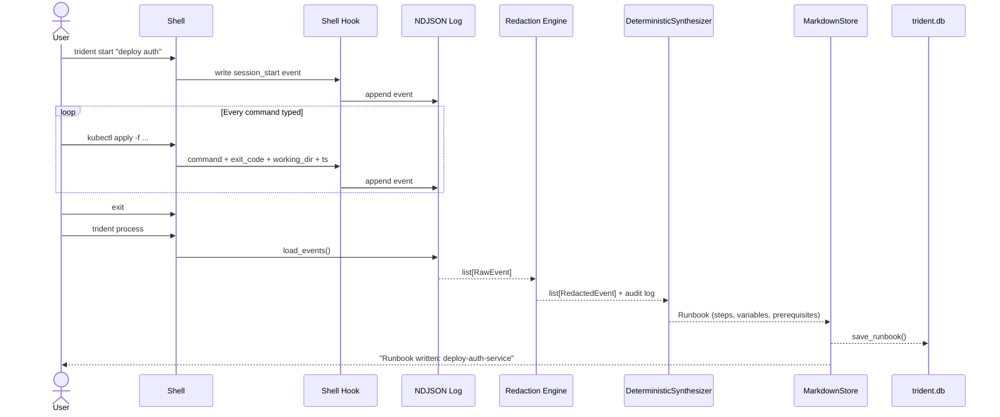
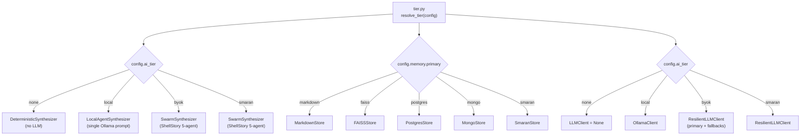
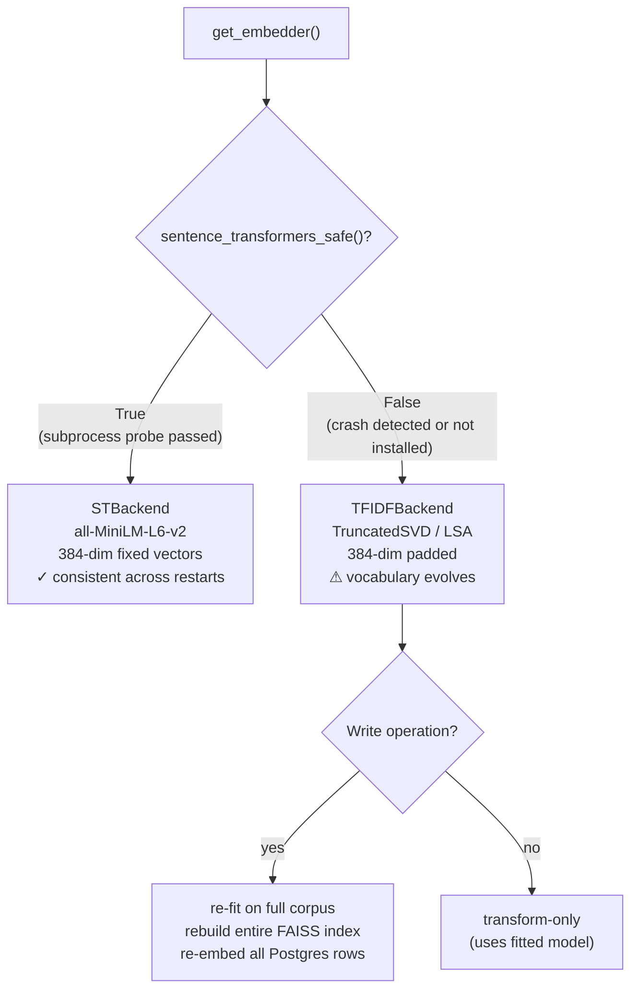
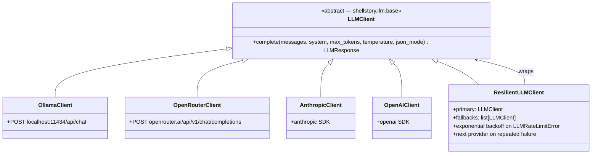
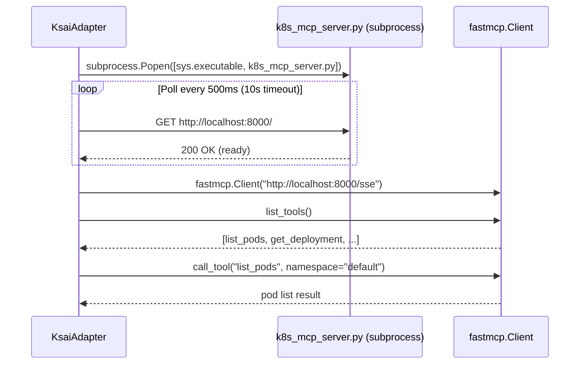
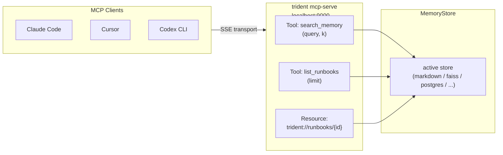

# Trident — Architecture

> Trident is a thin orchestration layer over three existing tools. It does not fork or rewrite them — it wraps, composes, and exposes them through a single CLI.

---

## Table of Contents

1. [System Overview](#1-system-overview)
2. [Directory Layout](#2-directory-layout)
3. [Data Flow](#3-data-flow)
4. [Tier Dispatch](#4-tier-dispatch)
5. [Embedding Strategy](#5-embedding-strategy)
6. [Memory Store Interface](#6-memory-store-interface)
7. [LLM Client Hierarchy](#7-llm-client-hierarchy)
8. [Integration Contracts](#8-integration-contracts)
   - [ShellStory](#shellstory)
   - [ksai](#ksai)
   - [Smaran](#smaran)
9. [MCP Bridge](#9-mcp-bridge)
10. [Test Coverage](#10-test-coverage)

---

## 1. System Overview



**Key design decisions:**

| Decision | Rationale |
|----------|-----------|
| ShellStory installed as editable pip dep | Clean library code — all models, capture, redact, and swarm callable directly |
| ksai runs as subprocess | `k8s_mcp_server.py` has module-level FastMCP state + `config.load_kube_config()` at import time — unsafe to import in-process |
| Smaran via REST only | TypeScript/Cloudflare Workers — not pip-installable |
| Trident has its own DB | `~/.trident/trident.db` — same schema as ShellStory's `~/.shellstory/shellstory.db`, different path |
| Config drives everything | `~/.trident/config.yaml` — no hardcoded model names, paths, or endpoints |

---

## 2. Directory Layout

```
trident/
├── cli.py                    # Click entry point — 10 commands
├── config.py                 # ~/.trident/config.yaml load / save / ensure_dirs
├── tier.py                   # Dispatch: which synthesizer / store / LLM?
│
├── capture/
│   ├── adapter.py            # Re-exports from shellstory (single import hub)
│   ├── hooks.py              # start_session · stop_session · get_active_session
│   ├── ndjson.py             # load_events · event_count wrappers
│   └── redact.py             # Thin wrapper over shellstory.redact_events
│
├── synthesize/
│   ├── deterministic.py      # Tier 0: noise filter + error-recovery + dir grouping
│   ├── local_agent.py        # Tier 1: single Ollama prompt → Runbook
│   ├── swarm.py              # Tier 2/3: delegates to ShellStory SwarmOrchestrator
│   └── chunker.py            # Runbook → embeddable chunks (overview + per step)
│
├── memory/
│   ├── base.py               # MemoryStore ABC: write / query / update / list
│   ├── _embed.py             # Shared embedding: sentence-transformers or TF-IDF
│   ├── markdown_store.py     # Tier 0: filesystem markdown + index.json
│   ├── faiss_store.py        # Tier 1+: FAISS L2 + embedding backends
│   ├── postgres_store.py     # pgvector cosine search
│   ├── mongo_store.py        # pymongo + Python-side cosine similarity
│   └── smaran_store.py       # Smaran REST API (POST /v3/documents + /v3/search)
│
├── execute/
│   ├── mechanical.py         # Tier 0: subprocess replay, stop on first failure
│   ├── ksai_adapter.py       # Wraps k8s_mcp_server.py subprocess + fastmcp.Client
│   └── mcp_bridge.py         # Exposes Trident memory as FastMCP SSE server
│
├── connectors/
│   ├── obsidian.py           # Write to Obsidian vault (pure filesystem + YAML frontmatter)
│   └── notion.py             # Notion REST API via httpx
│
├── llm/
│   ├── base.py               # Re-exports LLMClient from shellstory.llm.base
│   ├── ollama_client.py      # POST http://localhost:11434/api/chat
│   ├── openrouter_client.py  # POST https://openrouter.ai/api/v1/chat/completions
│   ├── anthropic_client.py   # anthropic SDK
│   ├── openai_client.py      # openai SDK
│   └── resilient.py          # Exponential backoff + fallback chain
│
└── ui/
    └── dashboard.py          # Rich Live dashboard (trident status --watch)
```

---

## 3. Data Flow

### Full pipeline (Tier 0)



### Step-by-step

```
trident start "deploy auth"
    └─ hooks.start_session()
          ├── Session(id=uuid) → trident.db
          ├── create ~/.trident/sessions/<id>.ndjson
          └── shellstory.capture.create_hook_file() → writes .sh / .ps1

[user runs commands]
    └─ hook appends: {"event_type":"command","command":"...","exit_code":0,...}

trident process
    ├── load_events(ndjson_path)          → list[RawEvent]
    ├── redact_events(events, "strict")   → RedactionResult
    │        shellstory.redact — 16 regex patterns (tokens, passwords, URLs, ...)
    │        $DB_CONNECTION_STRING → typed placeholder
    ├── DeterministicSynthesizer.synthesize()
    │        1. filter  → keep event_type == "command"
    │        2. denoise → drop noise tokens (cd, ls, pwd, clear, echo, ...)
    │        3. recover → error→fix pairs (failed + fix same dir → drop failed)
    │        4. navigate → drop lone cd with no follow-up in that dir
    │        5. group   → consecutive same working_dir → RunbookStep
    │        6. extract → env vars, destructive op warnings
    ├── chunker.chunk_runbook(runbook)    → list[dict] (overview + per-step)
    └── MarkdownStore.write(chunks, metadata)
              ├── renders professional markdown (TOC, tables, bash blocks, footer)
              ├── writes ~/.trident/memory/runbooks/<slug>.md
              └── updates ~/.trident/memory/index.json

trident query "deploy auth"
    └── MarkdownStore.query(text, k=5)
              ├── tokenize query → word set
              ├── score each index entry (title + slug + tags)
              └── return top-k with 400-char snippet

trident run
    └── MechanicalReplayer.run(runbook)
              ├── for each RunbookStep with a command:
              │     ├── if confirm_destructive and matches pattern → Y/N prompt
              │     ├── subprocess.run(command, shell=True, timeout=300)
              │     └── stop on first non-zero exit_code
              └── return ReplayResult(steps_run, steps_total, failed_step)
```

---

## 4. Tier Dispatch



**Fallback cascade for Tier 1:**
If Ollama is unreachable during synthesis, `LocalAgentSynthesizer` catches the `LLMError` and delegates to `DeterministicSynthesizer`. The user gets a working runbook; the synthesis quality note in the header reflects the actual tier used.

---

## 5. Embedding Strategy

`trident/memory/_embed.py` provides `get_embedder()` → `(embedder, is_stable: bool)`



**Why subprocess probe?**
On Python 3.14 + Windows, importing `SentenceTransformer` triggers a C-level access violation (exit code 5). This is not catchable by Python `try/except`. Trident runs the import in a child process and checks the return code. Result is cached module-level (`_ST_SAFE`) so the probe fires at most once per process.

**TF-IDF correctness:**
Re-fitting changes the vector space. All previously stored vectors become inconsistent with the new model. Trident resolves this by rebuilding the entire index from scratch on every write when TF-IDF is the backend (`FAISSStore._rebuild_index()`). This is O(n) but correct.

---

## 6. Memory Store Interface

```python
class MemoryStore(ABC):
    def write(self, chunks: list[dict], metadata: dict) -> str:
        """Persist chunks. Returns store_id (slug or UUID)."""

    def query(self, text: str, k: int = 5) -> list[dict]:
        """Return top-k ranked chunks matching text."""

    def update(self, store_id: str, content: dict) -> None:
        """Overwrite existing entry."""

    def list(self) -> list[dict]:
        """Return all entries as metadata dicts, newest first."""
```

**Chunk schema** (produced by `synthesize/chunker.py`):

```python
{
    "type": "overview" | "step",
    "title": str,
    "text": str,           # embedding-optimized plain text
    "step_number": int,    # steps only
    "runbook_id": str,
    "session_id": str,
}
```

**Metadata schema** (passed alongside chunks from `cli.py process`):

```python
{
    "title": str,
    "session_id": str,
    "runbook_id": str,
    "tier": "none" | "local" | "byok" | "smaran",
    "created_at": str,     # ISO 8601
    "runbook": dict,       # full Runbook.model_dump() for rich rendering
}
```

---

## 7. LLM Client Hierarchy



The `complete()` signature is identical to ShellStory's `LLMClient` so ShellStory's 5-agent swarm works unmodified with any Trident-registered client.

---

## 8. Integration Contracts

### ShellStory

Trident installs ShellStory as `pip install -e shellstory-main/shellstory-main` and imports from it directly. No monkey-patching.

| ShellStory symbol | Trident usage |
|-------------------|--------------|
| `shellstory.capture.create_hook_file` | Session start (writes `.sh` / `.ps1`) |
| `shellstory.capture.write_session_start_event` | Session start event |
| `shellstory.capture.generate_{bash,zsh,powershell}_hook` | Hook code generation |
| `shellstory.models.*` | All Pydantic models — re-exported via `capture/adapter.py` |
| `shellstory.redact.redact_events` | PII redaction (16 regex patterns) |
| `shellstory.db.Database` | Session + Runbook CRUD (`Database(db_path=~/.trident/trident.db)`) |
| `shellstory.agents.swarm.SwarmOrchestrator` | Tier 2/3 synthesis |
| `shellstory.llm.base.LLMClient` | Abstract LLM interface — Trident implements it |
| `shellstory.utils.ndjson.*` | NDJSON I/O utilities |

**DB isolation:** Trident passes its own path (`~/.trident/trident.db`). ShellStory's DB lives at `~/.shellstory/shellstory.db`. Same schema, fully isolated.

---

### ksai

`k8s_mcp_server.py` uses module-level `FastMCP` state and calls `config.load_kube_config()` at import time. Importing it in-process causes side effects. Trident runs it as a managed subprocess:



**Keyword fallback:** When `ai_tier == none`, `KsaiAdapter.query()` does keyword matching (pod / deploy / service) instead of asking the LLM to select a tool.

---

### Smaran

Smaran is a TypeScript/Cloudflare Workers service. Trident accesses it entirely through its REST API — no SDK, no subprocess.

```
Write:  POST https://api.smaran.ai/v3/documents
        Body: { "content": chunk_text, "metadata": {...} }
        Auth: Bearer {smaran_api_key}

Query:  POST https://api.smaran.ai/v3/search
        Body: { "query": text, "limit": k }

List:   POST https://api.smaran.ai/v3/documents/documents
        Body: { "limit": 100 }
```

---

## 9. MCP Bridge

`trident mcp-serve` starts a FastMCP SSE server on port 9000 (configurable).



**Exposed tools:**

| Name | Signature | Returns |
|------|-----------|---------|
| `search_memory` | `(query: str, k: int = 5)` | Ranked chunk dicts |
| `list_runbooks` | `(limit: int = 20)` | Metadata list |
| `trident://runbooks/{id}` | _(resource)_ | Full markdown text |

---

## 10. Test Coverage

```
tests/
├── test_deterministic_synth.py   17 tests
│     Noise filter · error-recovery collapsing · dir grouping · env var extraction
│     All run with pure function calls — zero mocks, zero LLM
│
├── test_capture.py               10 tests
│     NDJSON load/save round-trip · Database CRUD · session prefix lookup
│
├── test_memory_stores.py         17 tests
│     MarkdownStore write/query/list · FAISSStore with TF-IDF backend
│     (monkeypatches _sentence_transformers_safe → False to bypass subprocess probe)
│
├── test_mechanical_replay.py      8 tests
│     Successful replay · stop-on-failure · destructive-op confirmation · timeout
│     (monkeypatches subprocess.run)
│
└── test_tier_resolution.py       12 tests
      Tier dispatch for all config variants · synthesizer dispatch · store dispatch
──────────────────────────────────────────────────────────────────────────────────
Total                             64 tests   all passing · zero API keys · zero network
```
